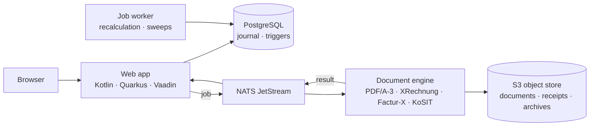

<!--
  Project: Little Trotter X-Invoice
  Copyright (c) 2026 Eifel42 Stefan Zils
  See LICENSE and NOTICE for license terms.
-->

# Little Trotter

  

  <strong>E-invoicing for small businesses that has to stand up to an audit — and is still a pleasure to use.</strong>

  <a href="https://github.com/Little-Trotter/invoice"><strong>Invoice Repository</strong></a> &bull;
  <a href="https://little-trotter.github.io/"><strong>Architecture Documentation (arc42)</strong></a>

---

Little Trotter turns quotations and invoices into everything German and EU law expects of them, in one click:
formal quotation authoring (*Angebotswesen*), a validated **XRechnung** or **Factur-X** file (EN 16931), a **PDF/A-3** document with the XML
embedded, a KoSIT validation report, and a signed archive package — with a tamper-evident
audit trail underneath. Built for freelancers, engineering offices and small and medium-sized companies.

> **Beta**: Little Trotter is under active development and provided as-is. Use it to evaluate, test and shape the product.

---

## 30-second tour

| You do | Little Trotter does |
|---|---|
| **Write the quote** (*Angebotswesen / Angebotsschreibung*) | Formal quotation authoring, itemized scope, revisions, and one-click conversion directly into invoices |
| **Write the invoice** (products, services, business trips) | Applies the right VAT rule, reverse charge across the EU, per-diem and mileage rates, and checks the data before you can send |
| **Press Send** | Assigns the number, freezes the document, generates PDF/A-3 + XRechnung/Factur-X **exactly once**, validates it with the official KoSIT validator, seals it with a checksum and a signed archive |
| **Attach receipts** | Hotel bills, tickets, delivery notes go into the invoice's annex and into the e-invoice as attachments — within a size budget the recipient's mail server will accept |
| **Cancel** | A proper storno document (type 384) is born beside the original; nothing is ever overwritten or deleted |
| **Hand over to the tax advisor** | One Excel workbook per invoice or per period: header, positions, change journal — typed cells, control formulas that recompute the totals, a cover sheet with a GDPR notice |

---

## Why it feels different

### Compliance, built in
- **Built for the trades and small firms.** Designed for craftsmen and small and medium-sized companies. Meets key European and German standards (§ 14 UStG, GoBD, EN 16931). Supports XRechnung 3.0.2, PDF/A-3, semantic model, and KoSIT validation.
- **Audit-proof audit trail.** Every status transition and document seal is recorded with tamper-evident cryptographic hashes in an append-only journal.

### Invoicing the way your customers demand it
- **From quote to invoice in one click.** Formal quotation authoring (*Angebotswesen / Angebotsschreibung*), itemized scope, revisions, and one-click conversion from accepted quotes directly into invoices.
- **One invoice, many rulebooks.** Handles different B2B profiles and requirements from authorities (`BT-10` Leitweg-ID) and enterprise customers (`BT-13` purchase order, `BT-11` project ref).
- **Your articles, their numbers.** Supports customer article references for your internal items.
- **Receipts travel with the invoice.** Manages multiple invoice receipts (materials, working time, travel costs) with automatic upload reduction to protect mail servers.
- **Cross-border VAT.** Handles multiple European VAT registrations (e.g. DE and LU VAT IDs) and intra-community reverse charge rules.

### Yours to run, wherever you like
- **Open, auditable, yours.** Open, auditable source code — freely available, no per-seat licensing, no vendor lock-in. Full digital sovereignty by design.
- **Ergonomics is a design goal.** A calm, keyboard-friendly interface (Vaadin Flow), German by default with international options.
- **Runs on a mini PC.** Designed along Green-IT principles: runs smoothly on quiet, entry-level office mini PCs with optional overnight sleep mode.
- **Local storage first.** RustFS provides local, S3-compatible object storage under your direct physical control.

---

## Under the hood

- **Kotlin on Quarkus**, Vaadin Flow UI, Hibernate/Panache, Flyway — a hexagonal, domain-driven core with explicit ports.
- **Documents** via Typst and Apache PDFBox, Mustang (CII), the embedded KoSIT validator and veraPDF; **exports** via Apache POI.
- **E-Mail Dispatch** via dedicated SCS (`kotlin-email`) with Ed25519-signed archive packages and NATS JetStream integration.
- **Quotation Engine** via dedicated module (`kotlin-quote`) with UBL Quotation XML synthesis and one-click conversion to invoices.

---

## Quality you can check

| Gate | What it guarantees |
|---|---|
| **Four test layers** | Unit tests with mocked third parties · integration tests against real PostgreSQL, NATS and S3 in Testcontainers · cross-module end-to-end tests through the real document pipeline · browser tests against the running stack |
| **Coverage gate** | 90 % lines and 90 % branches on the aggregate report of a full `make test` — never skipped, never lowered |
| **Static analysis** | ktlint, detekt (ratchet baseline), sqlfluff for migrations, format linters for configs, Qodana at zero errors |
| **Supply chain** | Gitleaks pre-commit, Trivy image scan, OWASP dependency check, CycloneDX SBOM per image |
| **Conformance** | veraPDF PDF/A-3 conformance suite, KoSIT XRechnung scenarios, ZUGFeRD reference examples |

---

## Roadmap & Philosophy

### Open Source as Cooperative Self-Help (The Raiffeisen Principle)

Little Trotter is rooted in the cooperative philosophy of **Friedrich Wilhelm Raiffeisen**:

> *"Was dem Einzelnen nicht möglich ist, das vermögen viele."*  
> *(What is impossible for one alone, many can achieve.)*

Craftsmen, freelancers, and small businesses face identical compliance challenges (§ 14 UStG, GoBD, mandatory e-invoicing) and risk becoming locked into high-cost, proprietary cloud monopolies. Open source serves as a modern cooperative: shared, transparent, durable infrastructure providing independence and digital sovereignty.

### Release Roadmap

#### Haflinger Release
*Active baseline — Planned for Q2/Q3 2027 (indicative)*

- ✅ Invoicing lifecycle, e-invoice generation, validation, archive packages, audit journal
- ✅ Receipts with budget rules, storno documents (type 384), Excel export with control formulas
- ✅ Domain-Driven Design (DDD) & Hexagonal Architecture: Clean decoupling of domain core, application use cases, and infrastructure ports
- ✅ Operational Efficiency & Flexibility: Minimal footprint (GreenIT guidelines) for 24/7 or overnight shutdown on a mini-server
- ✅ Business trips: Consolidated entry with itemized components, per diems, and dedicated workbook
- 🔧 Production Hardening: Monitoring, logging, performance tuning, and audit security

#### Andalusian Release
*Active development — Planned for Q3 2027 (indicative)*

- ✅ B2B Invoice Emails: Autonomous email dispatch via dedicated SCS (`kotlin-email`), integrated with IDW PS 880-compliant archive interfaces
- ✅ Postfach & Envelope Preview: Interactive compose layout, recipient inspection, and send bar
- ✅ Email Templates: Standardized B2B invoice email templates with typed placeholders
- 🔧 System Hardening & Transport Security: Encrypted SMTP/TLS transfer, authentication pipelines (SPF, DKIM, DMARC), and robust bounce handling
- 🔧 Automated Delivery Testing: End-to-end integration tests of mail and document dispatch against Testcontainers mail servers

#### Black Forest Fox (*Schwarzwälder Fuchs*) Release
*In Entwicklung (Beginn) — Planned for Q3/Q4 2027 (indicative)*

- 🔄 Quotation Engine (*Angebotswesen / Angebotsschreibung* — begonnen / in Umsetzung): Formal quotation authoring, itemized scope, revisions, and one-click conversion from accepted quotes directly into audit-proof invoices
- 🔄 System Hardening & Revision Integrity: Tamper-resistant locking of finalized quotes, immutable revision history, and unbroken sequence numbering
- 🔄 Rigorous Testing & Data Consistency: Comprehensive test suites for complex quotation structures, tiered discounts, and unit conversions
- 🔄 Smooth User Operations: Quick filters for open quotations, expiration notices, and seamless local multi-user workflows

#### Percheron Release
*On demand — Dependent on community need*

- 💡 [Factur-X Integration](https://fnfe-mpe.org/factur-x/): Cross-border B2B invoicing profiles for France, Luxembourg, and Belgium — scheduled strictly upon demand from the user community

---

## License and attribution

- Software: [Apache License 2.0](LICENSE).
- Concept and design: [CC BY 4.0](https://creativecommons.org/licenses/by/4.0/) &mdash; credit *Little Trotter (https://github.com/little-trotter)*.
- Founded and maintained by **Stefan Zils (Eifel42)**.
